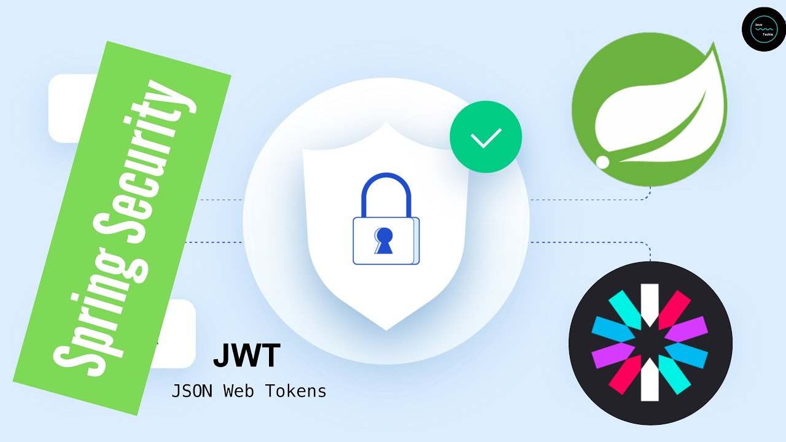
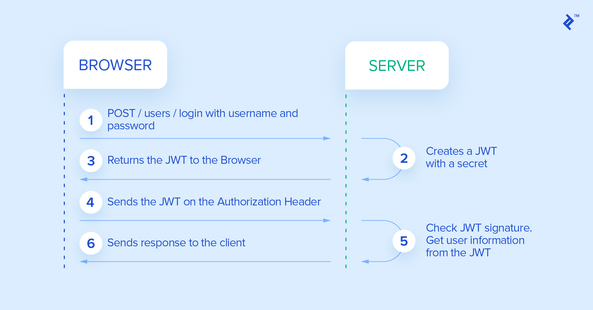
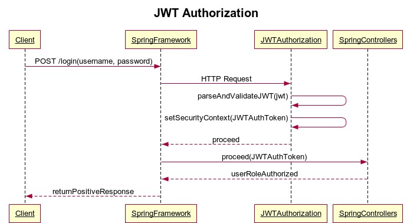

A spring JWT authentication restful service API for Great OutDoors.	
	
server.port=9000	

spring.application.name=authentication_service	

## Description 	
	

## Sequence flow

## Tools implemented 
* [Netflix Hystrix fault tolerance](https://spring.io/guides/gs/circuit-breaker/)
* [Swagger](https://swagger.io/)
* [Netflix Actuator](https://docs.spring.io/spring-boot/docs/current/reference/html/production-ready-features.html)
* [Netflix Zuul gateway](https://cloud.spring.io/spring-cloud-netflix/multi/multi__router_and_filter_zuul.html)
* [Netflix Eureka server](https://cloud.spring.io/spring-cloud-netflix/reference/html/)

## Data source	
spring.datasource.url=jdbc:oracle:thin:@localhost:1521:orcl  	

spring.datasource.username=sprint2db	

spring.datasource.password=student123	

spring.jpa.show-sql=true	

spring.jpa.hibernate.ddl-auto=update	

spring.jpa.properties.dialect=org.hibernate.dialect.OracleDialect	

## Current Actors
	
* USER	

* ADMIN	

* RETAILER	

* PRODUCT_MASTER	

You can change actors at /src/main/java/com/cg/iter/entity/ERole according to your project.

